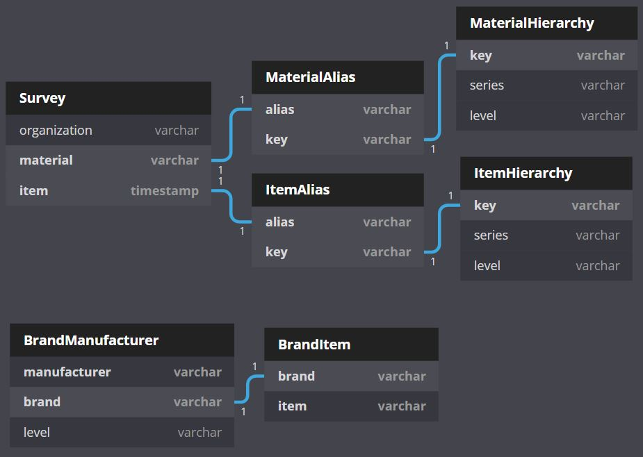

---
---

I am advancing data science in plastic pollution research by creating, reporting guidelines, database structures, and data analysis tools to harmonize, compare, and reproduce research. In trash research, studies use different words to describe the same type of trash or use words which are related to one another by a hierarchy. I have been working to develop a taxonomic system of relational tables called the trash taxonomy to alleviate the challenges in interpreting results between studies.

 
Update:
We published the Microplastics Reporting Guidelines in [Applied Spectroscopy](https://doi.org/10.1177%2F0003702820930292)
The Trash Taxonomy is [LIVE](https://wincowger.shinyapps.io/trashtaxonomy)

P.S. I believe that data facilitates knowledge, knowledge facilitates power, and power in the hands of many can move mountains. I am an open data fanatic. I curate data on trash in the environment from scientists and government groups around the world so that their data can be turned into action. Please help me spread data to everyone you know by sharing this [Data LINK](https://osf.io/k4th7/) and let me know if there are any datasets you know of that I should add or if you would like to be involved.
