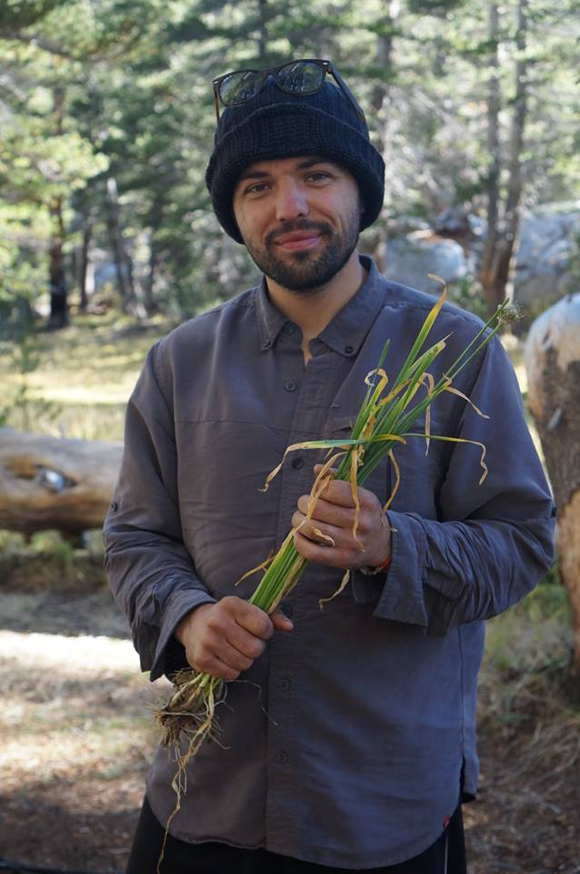

---
---

<link rel="stylesheet" href="styles.css" type="text/css">

I am a Research Scientists at the [Moore Institute for Plastic Pollution Research](https://mooreplasticresearch.org/). My science focuses on identifying solutions to plastic pollution and assessing their effectiveness. As an applied scientists, I work with nonprofit groups like [Let’s Do It World](https://www.letsdoitworld.org/) and [5 Gyres](https://www.5gyres.org/), government agencies like [SCCWRP](http://www.sccwrp.org/), [Trash Monitoring Workgroup](https://mywaterquality.ca.gov/monitoring_council/trash_monitoring/), and the [Ocean Protection Council](http://www.opc.ca.gov/), and academics to implement science in practice. 

My full CV is available [here](files/WinCowgerCV.pdf).